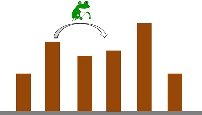

### 例2：カエルの移動問題
#### --- 問題 ---
N個の足場があり、左からi番目の足場（足場iとする）の高さはh_iである。
カエルは以下の行動を繰り返すことで、足場1から足場Nに移動したい。
1. 足場iからi+1にジャンプする：体力|h_i - h_(i+1)|を消費する。
2. 足場iからi+2にジャンプする：体力|h_i - h_(i+2)|を消費する。

この時、消費する体力の合計値として考えられる最小値を求めよ。

- INPUT:
```
N
h_1 h_2 ... h_N
```
- OUT:
```
ans
```

#### --- 方針 ---
足場1からiまで移動するために消費する最小の体力をdp[i]とし、dp[1], dp[2], ... dp[N]の順に計算することを考える。

まず、足場1から1までは移動しなくてもたどり着けるため、dp[1] = 0となる。また、足場1から2までは直接ジャンプするしかないため。dp[2] = |h_1 - h_2|である。

次に、足場i(≥ 3)に移動する方法については以下の2つが考えられる：
1. 体力|h_(i-1) - h_i|を消費して、1個前の足場からジャンプする。
2. 体力|h_(i-2) - h_i|を消費して、2個前の足場からジャンプする。

それぞれの場合について、漸化式で次のように書くことができる：
1. dp[i] = dp[i-1] + |h_(i-1) - h_i|
2. dp[i] = dp[i-2] + |h_(i-2) - h_i|

求めるdp[i]は最小値であるから、上記の最小値をdp[i]とすればよい。

#### --- ソースコード ---
```C++
#include <iostream>
#include <cmath>    // abs()
using namespace std;

int main() {
    int N;
    cin >> N;

    int H[N+1];
    for(auto i = 1; i < N+1; i++) {
        cin >> H[i];
    }

    int dp[N+1];
    dp[1] = 0;
    dp[2] = abs(H[2] - H[1]);
    for(auto i = 3; i < N+1; i++) {
        int v1 = dp[i-1] + abs(H[i] - H[i-1]);
        int v2 = dp[i-2] + abs(H[i] - H[i-2]);
        dp[i] = min(v1, v2);
    }

    cout << dp[N] << endl;

    return 0;
}
```

### 参考
- 問題解決のための「アルゴリズム×数学」が基礎からしっかり身につく本：p.118-122